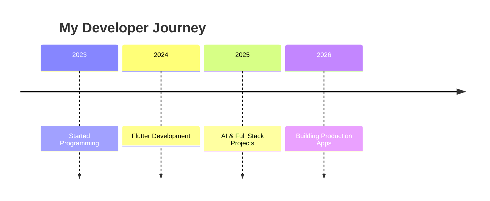

<!-- ========================================================= -->
<!--            MUHAMMAD AYAZ - GITHUB PROFILE README          -->
<!-- ========================================================= -->

<div align="center">


<br>


<br><br>


</div>

---

# 👋 Hey, I'm Muhammad Ayaz


### 🚀 About Me

I'm a passionate **Full Stack Developer** from **Pakistan 🇵🇰** who loves building modern digital products.

I enjoy turning ideas into beautiful, responsive, and high-performance applications using modern technologies.

### 💼 What I Do

- 📱 Flutter Mobile Apps
- 🌐 React & Next.js Websites
- 🤖 AI Powered Applications
- 🔥 Firebase Backend
- 🛒 WordPress & WooCommerce
- 🎨 Modern UI/UX Design

### 🌱 Currently Learning

- ⚡ Advanced Flutter Architecture
- 🚀 Backend Development
- 🤖 Artificial Intelligence
- ☁️ Cloud Technologies

### 🎯 My Mission

> Build software that solves real-world problems and create digital experiences people love.

<br clear="right"/>

---

# ⚡ Tech Stack

<div align="center">

### 🚀 Languages


<br><br>

### 💻 Frameworks


<br><br>

### 🛠️ Database & Cloud


<br><br>

### 🎨 Design Tools


<br><br>

### ⚙️ Tools


</div>

---

## 💻 Core Skills

<div align="center">

| 🚀 Development | ⚡ Frameworks | 🤖 AI & Cloud | 🎨 Design |
|:--------------:|:------------:|:-------------:|:---------:|
| Flutter | React.js | AI Applications | Figma |
| Dart | Next.js | Firebase | UI/UX |
| Python | Node.js | REST APIs | Canva |
| C++ | WordPress | MySQL | Responsive Design |

</div>

---

<div align="center">

### 💭 Favorite Quote

> **"Turning ideas into digital experiences."**

</div>

---

# 🚀 Featured Projects

<div align="center">

| Project | Description | Tech |
|---------|-------------|------|
| 🌟 **Luxury Portfolio** | A premium portfolio website with modern animations, glassmorphism, and responsive design. | Next.js • React • Tailwind |
| 🤖 **AI ChatBot** | AI-powered chatbot with modern Flutter UI and backend integration. | Flutter • FastAPI • AI |
| 🛒 **AZ Store** | Complete eCommerce application with Firebase Authentication, Cart, and Admin features. | Flutter • Firebase |
| 🎓 **University LMS** | Learning Management System for students with notes, quizzes, assignments, and admin panel. | Flutter • Firebase |
| 🧠 **AI Handwriting Generator** | Converts digital text into realistic handwriting with OCR and PDF export. | Python • OCR • Flutter |

</div>

---

# 💼 Currently Working On

```text
🚀 Luxury Portfolio Website

📱 Flutter Production Apps

🤖 AI Based Applications

🌐 React & Next.js Projects

🛒 Firebase eCommerce Systems

🎨 Premium UI/UX Design
```

---

# 📈 GitHub Activity

<div align="center">

[](https://github.com/ayaz16hub)

</div>

---

# 📊 GitHub Statistics

<div align="center">


<br><br>


</div>

---

# 🏆 GitHub Achievements

<div align="center">


</div>

---

## 🚀 Developer Timeline



# 🔥 Highlights

<div align="center">

🏆 Building Real-World Applications

📱 Passionate Flutter Developer

⚛️ Modern React & Next.js Developer

🤖 AI Enthusiast

🌐 WordPress Expert

🚀 Always Learning New Technologies

</div>

---


# 🌐 Let's Connect

<div align="center">

<a href="https://linkedin.com/in/mr-ayaz">

</a>

&nbsp;&nbsp;&nbsp;

<a href="mailto:ayazfreelancer16@gmail.com">

</a>

&nbsp;&nbsp;&nbsp;

<a href="https://github.com/ayaz16hub">

</a>

&nbsp;&nbsp;&nbsp;

<a href="https://instagram.com/mr_malik_ayaz">

</a>

&nbsp;&nbsp;&nbsp;

<a href="https://youtube.com/@mr_AYAZ_Az">

</a>

</div>

---

# 🎯 2026 Goals

<div align="center">

| Goal | Status |
|:-----------------------------|:------:|
| 🚀 Become Full Stack Developer | 🟢 |
| 📱 Publish Production Flutter Apps | 🟢 |
| 🤖 Master AI Development | 🟡 |
| 🌍 Contribute to Open Source | 🟡 |
| 💼 Grow My Freelancing Career | 🟢 |
| ⭐ Build SaaS Products | 🔥 |

</div>

---

# ⚡ Fun Facts

```yaml
Name: Muhammad Ayaz

Country: Pakistan 🇵🇰

Role: Full Stack Developer

Favorite Language: Dart ❤️

Currently Building:
   Flutter Apps
   AI Applications
   Luxury Portfolio
   Modern Web Apps

Hobbies:
   Coding
   UI Designing
   Learning New Tech
   Coffee ☕

Dream:
   Build Products Used Worldwide 🌎
```

---

# 🐍 Contribution Snake

<div align="center">


</div>

---

## 💻 Technologies I Love

<div align="center">

| Mobile | Frontend | Backend | Database |
|:------:|:--------:|:-------:|:--------:|
| Flutter | React | FastAPI | Firebase |
| Dart | Next.js | Node.js | MySQL |

</div>

# 💬 Developer Philosophy

<div align="center">

## 🚀 "Dream Big. Build Bigger."

*"Every great application starts with one simple idea and thousands of lines of code."*

</div>

---

# ❤️ Support My Work

<div align="center">

⭐ Star my repositories

🍴 Fork my projects

👨‍💻 Follow my GitHub

💬 Let's build something amazing together!

</div>

---

<div align="center">


### Thanks for visiting my profile ❤️


</div>
